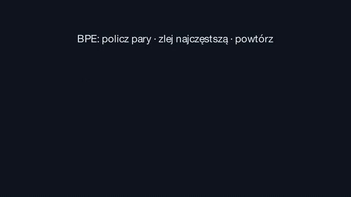

# maciej — byte-level BPE dla polskiego (HPLT v3) + wizualizacja Manim

Byte-level BPE napisany **od zera w czystym Pythonie** (bez `tokenizers`, bez
`sentencepiece`), trenowany na [`SlayerLab/hplt-v3-pl-cleaned`](https://huggingface.co/datasets/SlayerLab/hplt-v3-pl-cleaned),
plus **2,5-minutowa animacja Manim**, która tłumaczy algorytm krok po kroku.

Rdzeń (`bpe.py`) jest dosłownym rozwinięciem slajdów 4.1–4.4 z warsztatu.
Trener produkcyjny (`train.py`) liczy to samo, tylko szybciej — i jest z rdzeniem
**testowany na parytet 1:1**.

## Wynik w jednym zdaniu

Nasz słownik **32 000** osiąga fertility **1,652** na polskim held-oucie —
**1,63× lepiej niż `cl100k_base` (GPT-4)**, który ma **3× większy słownik**.
Przewaga utrzymuje się poza domeną treningową (1,40–1,59×), round-trip jest
bezstratny, a **99,1 %** słownika faktycznie się używa (cl100k na polskim: 23,8 %).

## Wizualizacja



Pełny film ma 2:25 (1080p60) i **nie leży w repo** — renderuje się jedną komendą
(`cd viz && ./render.sh -qh`, wynik w `viz/media/videos/scenes/1080p60/bpe-full.mp4`).
Powyższy GIF to skrócona scena `S2_Gif`. Pięć scen filmu:

| scena | slajdy | o czym |
|---|---|---|
| `S1_Dlaczego` | 3–4 | czemu nie znak i nie słowo (eksplozja fleksji, `<UNK>`) |
| `S2_Algorytm` | 7–8 | BPE na korpusie `aaabdaaabac` — z remisem i merge'em niezachodzącym |
| `S3_Bajty` | 15 | 256 bajtów zamiast ~150k znaków Unicode; „ę" = 2 bajty |
| `S4_Encode` | 13 | kolejność merge'y — i dlaczego błąd jest **cichy** |
| `S5_Fertility` | 16–20 | nasz tokenizer vs cl100k na **zmierzonych** liczbach |

Sceny renderują się z `viz/scenes.py`; liczby w S5 czytane są z
`results/viz_data.json` (świadomie bez fallbacku — lepiej, żeby render padł, niż
żeby film pokazał zmyślone wyniki).

## Struktura

```text
maciej/
  bpe.py              # rdzeń 1:1 ze slajdów — 4 funkcje, zero zależności
  tokenizer.py        # BPETokenizer: pretokenizacja, tokeny specjalne, JSON I/O
  train.py            # trening produkcyjny (pretokenizacja + inkrementalne liczniki + kopiec)
  evaluate.py         # fertility / zn-tok / Rényi / round-trip + odniesienia tiktoken
  eval_ood.py         # to samo poza domeną (Wolne Lektury, Wikipedia PL)
  inspect_tokens.py   # jakościowo: co robi z fleksją i z przypadkami ze slajdu 6
  prepare_data.py     # wycięcie korpusu i held-outu z parquetu HPLT
  test_bpe.py         # asserty ze slajdów + parytet szybki-vs-naiwny (12 testów)
  make_tables.py      # tabele markdown z metrics.json (żeby README nie kłamało)
  tokenizers/*.json   # artefakty: 8k, 16k, 32k (główny), 32k-gpt2, 64k
  results/            # metrics.json, metrics_ood.json, logi treningów
  viz/                # sceny Manim, GIF, film
```

## Algorytm — dokładnie ze slajdów

`bpe.py` to cztery funkcje ze slajdów 4.1–4.4 (`get_pair_counts`, `merge`,
`train_bpe`, `encode`) plus dekoder. Naiwna pętla `O(n·m)`: po każdym merge'u
przelicza **wszystkie** pary. Wolna i taka ma być — to wersja do czytania.

`train.py` liczy to samo, ale:

1. **pretokenizacja** (slajd 18) — korpus → `{pretoken: częstość}`. Zamiast
   ~300 mln symboli mamy 1,28 mln typów słów z wagami;
2. **inkrementalne liczniki** — po merge'u dotykamy tylko słów, które tę parę
   zawierały, i korygujemy liczniki różnicowo;
3. **kopiec leniwy** — `max()` po ~2 mln par × 32k merge'y to 6·10¹⁰ operacji;
   kopiec z leniwym usuwaniem załatwia to w 227 s.

Że to naprawdę ten sam algorytm, pilnuje `test_bpe.py::test_parity_fast_vs_naive`:
bez pretokenizacji (jeden „typ słowa" = cały tekst) oba muszą dać **identyczne**
merge'e. Wszystkie 12 testów zielone.

## Trening

| | |
|---|---|
| dane | `SlayerLab/hplt-v3-pl-cleaned`, shard `european_hplt_v3_pl_bin8_6_p0.parquet` (494 460 dok.) |
| korpus treningowy | **314,6 MB** / 136 585 dokumentów (row-groupy 0–6) |
| held-out | row-group 24, **10,5 MB** / 4 773 dok. — **nieużywany w treningu** |
| pretokeny | 1 277 668 unikalnych typów, 52 987 936 wystąpień |
| trening 32k | 31 743 merge'y w **227 s** (czysty Python, 1 rdzeń) |
| tie-break | `min_pair` (patrz niżej) |

Ostatni merge w 32k ma częstość **317** — ogon jest zdrowy, 314 MB spokojnie
starcza na ten rozmiar słownika. Przy 64k utylizacja spada do 96,9 %, co jest
pierwszym sygnałem, że korpus zaczyna się kończyć.

## Wyniki

### Porównanie (held-out 10,5 MB, 4 773 dok.)

| tokenizer | słownik | zn/tok | fertility | Rényi | użyty słownik | zdanie ze slajdu 16 | round-trip |
|---|---:|---:|---:|---:|---:|---:|---|
| **hplt-pl-32k-pl** (nasz) | 32 000 | **4.37** | **1.652** | 0.453 | **99.1%** | **16** | tak |
| o200k_base (GPT-4o) | 200 019 | 3.12 | 2.316 | 0.442 | 15.1% | 23 | tak |
| cl100k_base (GPT-4) | 100 277 | 2.67 | 2.698 | 0.470 | 23.8% | 32 | tak |
| gpt2 | 50 257 | 1.95 | 3.707 | 0.428 | 38.6% | 36 | tak |

To jest slajd 20 odtworzony na własnych danych: Bielik/APT4 bije generycznego
Mistrala 2,40 → 4,78 zn/tok na Konstytucji; u nas 2,67 → 4,37 na web-crawlu.
Ten sam efekt, ten sam rząd wielkości — **przy 3× mniejszym słowniku niż cl100k**.

### Poza domeną treningową

Tokenizer trenowany na web-crawlu, ewaluowany na web-crawlu, to ta sama
dystrybucja — przewaga mogłaby być artefaktem dopasowania do domeny. Nie jest:

| korpus | nasz 32k | nasz 64k | cl100k | o200k | przewaga 32k vs cl100k |
|---|---:|---:|---:|---:|---:|
| held-out HPLT (in-domain, 10,5 MB) | **1.652** | 1.517 | 2.698 | 2.316 | 1.63× |
| literatura, Wolne Lektury (3,4 MB) | **1.856** | 1.730 | 2.591 | 2.293 | 1.40× |
| encyklopedia, Wikipedia PL (0,7 MB) | **1.885** | 1.715 | 2.988 | 2.595 | 1.59× |

XIX-wieczna proza kosztuje nas ~12 % fertility — i tam przewaga jest najmniejsza.
To uczciwa cena za korpus zrobiony wyłącznie z web-crawla.

### Krzywa vocab → fertility

| słownik | zn/tok | fertility | Rényi | użyty słownik | plik |
|---:|---:|---:|---:|---:|---:|
| 8 000 | 3.50 | 2.062 | 0.560 | 98.9% | 0.4 MB |
| 16 000 | 3.94 | 1.831 | 0.502 | 99.3% | 0.7 MB |
| 32 000 | 4.37 | 1.652 | 0.453 | 99.1% | 1.5 MB |
| 64 000 | 4.76 | 1.517 | 0.413 | 96.9% | 3.1 MB |

Malejące zyski: −0,231 → −0,179 → −0,135 na podwojenie słownika. Rényi
konsekwentnie spada — większy słownik to bardziej nierówny rozkład tokenów.

### Pretokenizer: `pl` vs `gpt2` — hipoteza, która się nie potwierdziła

Założyłem, że angielskie skróty (`'s`, `'t`, `'re`…) w regexie GPT-2 marnują
merge'e na sekwencje, których w polskim korpusie prawie nie ma. Zrobiłem wariant
`pl` (bez skrótów, cyfry w runach ≤3) i wytrenowałem oba na tym samym korpusie:

| pretokenizer | zn/tok | fertility | Rényi | użyty słownik |
|---|---:|---:|---:|---:|
| `pl` (bez angielskich skrótów, cyfry ≤3) | 4.37 | 1.652 | 0.453 | 99.1% |
| `gpt2` (klasyczny) | 4.38 | **1.647** | 0.453 | 99.1% |

**Różnica 0,005 — i to na korzyść `gpt2`.** Hipoteza nieprawdziwa: wybór
pretokenizera jest w tej skali szumem. Dźwignią jest rozmiar słownika
(−0,231 na podwojenie) i to, że korpus jest polski — nie regex.

## Co wyszło w praniu

**1. Remis w BPE jest niedookreślony — i slajd 8 to pokazuje.**
Na korpusie `aaabdaaabac`, w drugim kroku, `(Z,a)` i `(a,b)` mają po 2 wystąpienia.
`max(counts, key=counts.get)` ze slajdu 4.3 wybiera parę napotkaną najwcześniej
i daje `Z`,`Za`,`Zab`. Trace ze slajdu 8 (`aa→Z`, `ab→Y`, `ZY→X` → `XdXac`)
wychodzi dopiero przy regule „para o najmniejszych ID". **Obie odpowiedzi są
poprawnym BPE.** Dodałem `tie_break` jako jawny parametr, bo bez tego dwie
poprawne implementacje cicho się rozjeżdżają — i dopiero to pozwala testować
parytet trenera z rdzeniem.

**2. Licznik par przeszacowuje liczbę zlań.**
W `aaabdaaabac` para `(a,a)` jest liczona **4×**, ale merge jest niezachodzący —
w `aaa` zlewa się tylko raz, więc realnych zlań jest 2. BPE mimo to wybiera
po liczniku. Pokazane wprost w animacji, bo na tablicy łatwo to przegapić.

**3. Wiodąca spacja jest częścią tokenu — i to widać w obie strony.**
Pretokenizator dokleja spację do słowa, więc `␣dom` i `dom` to **dwa różne
tokeny**:

| forma | nasz 32k | cl100k |
|---|---|---|
| `' książka'` | **1** `␣książka` | 3 `␣ksi\|ąż\|ka` |
| `'książka'` | 3 `k\|sią\|żka` | 3 `ksi\|ąż\|ka` |
| `' domach'` | **1** `␣domach` | 2 `␣dom\|ach` |
| `'domach'` | 2 `do\|mach` | 2 `dom\|ach` |

W tekście ciągłym słowo prawie zawsze ma przed sobą spację i tam wygrywamy
z dużym zapasem. Ale **bez spacji nasz tokenizer bywa gorszy** — `k|sią|żka` to
zła granica. Forma ze spacją zjadła miejsce w słowniku, a naga została rzadka.
To znany koszt byte-level BPE (GPT-2 ma to samo); kto tego nie chce, dokleja
`add_prefix_space` albo tnie spację osobnym tokenem.

**4. Rozmiar słownika to myląca metryka — ale utylizacja już nie.**
cl100k ma 100 277 tokenów i na polskim używa **23,8 %** z nich; o200k — 15,1 %.
Nasze 32k używa 99,1 %. Za nieużywane tokeny płaci się pełną cenę w macierzy
embeddingów (`2·d·V`), więc „duży słownik" potrafi być kosztem bez korzyści.

## Fleksja pod mikroskopem

`inspect_tokens.py` pokazuje, że fertility to metryka **dystrybucyjna** — mierzy
kompresję, nie morfologię. Nasz tokenizer ładnie łapie prefiksy i rdzenie:

```
' przepisać'   2  ␣przepisa | ć           (cl100k: 4  ␣prz|ep|isa|ć)
' zapisywać'   2  ␣zapisy | wać           (cl100k: 5  ␣z|apis|y|wa|ć)
' niedopisany' 3  ␣niedo | pisa | ny      (cl100k: 4  ␣nied|op|is|any)
```

…ale granice nie są morfemami: `␣zapisy|wać` tnie wewnątrz tematu, a nie na
`za-pis-ywa-ć`. Lepsza fertility ≠ lepsza segmentacja gramatyczna.

Emoji `🎉` rozpada się na 4 osobne bajty-tokeny (każdy to urwany kawałek UTF-8,
stąd `�` przy podglądzie) — **i mimo to `decode(encode(x)) == x`**. Byte-level
nie ma `<UNK>`, płaci długością.

## Odpowiedź na pytanie zamykające (slajd 21)

> *Na jakim korpusie i jak dużym słowniku trenować tokenizer pod polski model?*

**Korpus:** polski web-crawl po bramce PII/jakości jest dobrą **bazą** — 314 MB
w zupełności wystarczyło na 32k (ostatni merge o częstości 317). Ale test OOD
pokazuje, że sam web-crawl kosztuje ~12 % fertility na literaturze, więc do
docelowego tokenizera domieszałbym literaturę, teksty prawne i encyklopedyczne.
Na słowniki 128k+ trzeba kilku GB — przy 64k utylizacja już spadła do 96,9 %.

**Słownik:** dla modelu tej klasy co Bielik/Mistral — **32k**, i to nie z
przyzwyczajenia: przejście 32k→64k kupuje 8 % fertility za **2× większą macierz
embeddingów i głowicę** (`2·d·V`). Przy małym modelu to zły interes; przy dużym
opłacalny punkt przesuwa się w stronę 64–128k. Decyduje `fertility × (body + 2·d·V)`,
a nie sam rozmiar słownika — dokładnie jak mówi slajd 20.

## Jak odtworzyć

```bash
# 1. korpus (pobiera 527 MB shard z HF; dane lądują poza repo)
uv run --with pyarrow --with huggingface_hub python prepare_data.py

# 2. trening (32k: ~4 min na jednym rdzeniu)
uv run --with regex --with pyarrow python train.py --vocab-size 32000 --pattern pl

# 3. metryki
uv run --with regex --with tiktoken python evaluate.py --limit-mb 10
uv run --with regex --with tiktoken python eval_ood.py
uv run --with regex --with tiktoken python inspect_tokens.py --compare

# 4. testy
uv run --with regex --with pytest python -m pytest test_bpe.py -q

# 5. animacja (ffmpeg wymagany; LaTeX NIE jest potrzebny — same Text/Pango)
cd viz && ./render.sh -qh && ./make_gif.sh
```

Użycie artefaktu:

```python
from tokenizer import BPETokenizer
tok = BPETokenizer.load("tokenizers/hplt-pl-32k-pl.json")
ids = tok.encode("Zażółć gęślą jaźń")
assert tok.decode(ids) == "Zażółć gęślą jaźń"
```

Zależności: `regex` (kategorie Unicode w pretokenizacji — `re` nie wie, że „ą"
to litera), `pyarrow` (parquet), `tiktoken` (tylko do porównań), `manim` (film).
**Sam BPE nie ma żadnych zależności** — `bpe.py` to czysty stdlib.

## Ograniczenia

- Korpus to **jeden shard** (314 MB z 12,3 GB zbioru) i **tylko web-crawl**.
  Na 32k to nie wąskie gardło, na 128k+ już tak.
- Merge'e nie przechodzą przez granice pretokenów — świadomy koszt
  pretokenizacji (slajd 18), ten sam co w GPT-2.
- Fertility i Rényi są dystrybucyjne: mierzą kompresję i rozkład, **nie**
  gramatyczność (patrz „Fleksja pod mikroskopem").
- Rényi liczę normalizując przez **pełny** rozmiar słownika (`H_α/ln V`, α=2,5),
  więc tokeny nieużywane są karane. Inna konwencja normalizacji da inne liczby.
- Tokeny specjalne: tylko `<|endoftext|>`. Ról `system`/`user`/`assistant`
  nie dodawałem — to decyzja formatu czatu, nie tokenizera.
